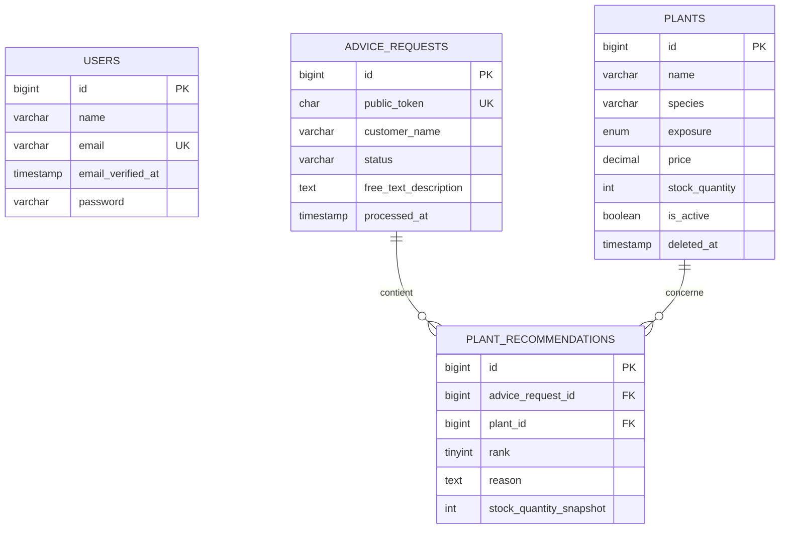

# Modèle de données expliqué

MySQL stocke le catalogue, les demandes, les recommandations et la queue. Laravel accède à ces tables avec Eloquent.

## Vue des relations



`users` ne possède pas de relation avec les demandes publiques. Le visiteur ne crée pas de compte. Le gérant utilise `users` pour accéder à l’administration.

## Table `users`

| Colonne | Type | Usage |
|---|---|---|
| `id` | entier non signé | Identifiant interne du gérant. |
| `name` | chaîne | Nom affiché dans l’administration. |
| `email` | chaîne unique | Identifiant de connexion et destination des notifications Breeze. |
| `email_verified_at` | date nullable | Preuve que Laravel considère le compte comme vérifié. |
| `password` | chaîne | Hash du mot de passe. Le mot de passe brut ne va pas en base. |
| `remember_token` | chaîne nullable | Jeton du choix « se souvenir de moi ». |
| `created_at`, `updated_at` | dates | Création et dernière modification. |

`User` implémente `MustVerifyEmail`. Les routes d’administration exigent `verified`, et les policies contrôlent aussi `email_verified_at`.

`password_reset_tokens` contient les jetons temporaires de mot de passe oublié. Cette table appartient au mécanisme Breeze.

## Table `plants`

| Colonne | Type final | Usage |
|---|---|---|
| `id` | entier non signé | Identifiant transmis à l’IA pour référencer une candidate. |
| `name` | `VARCHAR(150)` | Nom commercial affiché. |
| `species` | `VARCHAR(180)` | Nom botanique ou espèce. |
| `description` | texte nullable | Informations utiles au visiteur et au conseiller. |
| `environment` | chaîne | `INDOOR`, `OUTDOOR` ou `BOTH`. |
| `exposure` | enum SQL | `SUN`, `PARTIAL_SHADE` ou `SHADE`. |
| `watering_level` | chaîne | Niveau d’arrosage. |
| `maintenance_level` | chaîne | Effort d’entretien requis. |
| `adult_height_cm` | entier nullable | Hauteur adulte utilisée par le préfiltrage. |
| `adult_width_cm` | entier nullable | Largeur adulte utilisée par le préfiltrage. |
| `price` | `DECIMAL(10,2)` | Prix affiché en MAD. |
| `stock_quantity` | entier non signé | Quantité disponible dans la pépinière. |
| `is_active` | booléen | Autorise ou exclut la plante du conseil. |
| `deleted_at` | date nullable | Marque une plante archivée par soft delete. |
| `created_at`, `updated_at` | dates | Suivi technique de la ligne. |

Le prix reste un décimal. PHP le manipule comme une chaîne lorsqu’une précision monétaire compte. Cette approche évite les erreurs d’arrondi des nombres flottants.

Le stock sert au catalogue et au préfiltrage. La création d’une recommandation ne le décrémente pas.

L’index composé sur l’activité, le stock, l’environnement et `deleted_at` aide les recherches de candidates. Eloquent ajoute la condition `deleted_at IS NULL` grâce à `SoftDeletes`.

## Table `advice_requests`

### Entrée du visiteur

| Colonne | Type | Usage |
|---|---|---|
| `id` | entier non signé | Identifiant interne utilisé par le Job. |
| `public_token` | `CHAR(64)` unique | Identifiant du lien public de suivi. |
| `customer_name` | chaîne nullable | Prénom facultatif. |
| `environment` | chaîne | Intérieur ou extérieur. |
| `exposure` | chaîne | Exposition principale. |
| `space_size` | chaîne | `SMALL`, `MEDIUM` ou `LARGE`. |
| `maintenance_availability` | chaîne | Temps d’entretien accepté. |
| `free_text_description` | texte | Besoin rédigé par le visiteur. |

La table ne contient plus `customer_email`. Laravel montre le lien de suivi après la soumission.

### Traitement et résultat

| Colonne | Type | Usage |
|---|---|---|
| `status` | chaîne | `PENDING`, `PROCESSING`, `COMPLETED` ou `FAILED`. |
| `space_summary` | texte nullable | Résumé validé du besoin. |
| `avoid_items` | JSON nullable | Colonne historique encore présente, sans usage dans le parcours MVP actuel. |
| `general_advice` | texte nullable | Conseils généraux validés. |
| `failure_message` | texte nullable | Message public nettoyé en cas d’échec. |
| `processing_started_at` | date nullable | Moment du claim par un worker. |
| `processed_at` | date nullable | Fin du traitement ou échec final. |
| `created_at`, `updated_at` | dates | Suivi technique. |

L’index `(status, created_at)` aide le suivi des demandes par état et date.

Le schéma ne conserve ni code d’échec séparé, ni réponse IA brute, ni critère animal. Ces éléments ont quitté le MVP.

## Table `plant_recommendations`

| Colonne | Type | Usage |
|---|---|---|
| `id` | entier non signé | Identifiant technique. |
| `advice_request_id` | clé étrangère | Demande qui possède la recommandation. |
| `plant_id` | clé étrangère | Plante réelle du catalogue. |
| `rank` | petit entier non signé | Position proposée par le conseiller puis validée. |
| `reason` | texte | Justification française validée. |
| `stock_quantity_snapshot` | entier non signé | Stock observé lors de la persistance. |
| `created_at`, `updated_at` | dates | Suivi technique. |

La contrainte unique `(advice_request_id, plant_id)` bloque deux recommandations de la même plante dans une demande. Le Job déduplique déjà la réponse, et MySQL fournit une seconde protection.

Les clés étrangères utilisent `RESTRICT` lors d’une suppression physique. La base refuse donc d’effacer une demande ou une plante référencée. Le catalogue utilise le soft delete pour conserver l’historique.

Le modèle `PlantRecommendation` charge une plante avec `withTrashed()`. La page d’historique peut afficher le nom d’une plante archivée.

Le snapshot de prix a été supprimé. Le MVP conserve la quantité observée pour l’audit, sans comparer cette valeur au stock courant dans l’interface.

## Tables `jobs` et `failed_jobs`

### `jobs`

Laravel y place les tâches en attente :

- `queue` indique la file ;
- `payload` contient le Job sérialisé ;
- `attempts` compte les essais ;
- `reserved_at` indique qu’un worker traite la tâche ;
- `available_at` fixe le prochain moment d’exécution.

Le worker supprime la ligne après un succès.

### `failed_jobs`

Laravel conserve un Job qui a épuisé ses essais. La table stocke son UUID, la connexion, le payload, l’exception et la date d’échec.

`failed_jobs` contient des informations techniques. `advice_requests.failure_message` contient le message produit pour l’utilisateur. Les deux tables répondent à des besoins différents.

## Relations Eloquent

### Une demande possède plusieurs recommandations

```php
public function recommendations(): HasMany
{
    return $this->hasMany(PlantRecommendation::class)
        ->orderBy('rank');
}
```

L’ordre fait partie de la relation. La vue reçoit les résultats classés sans répéter `orderBy()`.

### Une recommandation appartient à une plante

```php
public function plant(): BelongsTo
{
    return $this->belongsTo(Plant::class)->withTrashed();
}
```

`withTrashed()` inclut les plantes archivées. Sans cet appel, Eloquent retournerait `null` après un soft delete.

## Pourquoi les migrations initiales contiennent des colonnes supprimées

La migration du 29 juillet crée le premier schéma. Les migrations suivantes montrent les décisions prises pendant le développement :

1. `2026_08_03_190000_simplify_mvp_schema.php` simplifie l’exposition et retire plusieurs champs reportés ;
2. `2026_08_06_100000_remove_customer_email_from_advice_requests.php` retire l’email visiteur.

Modifier une ancienne migration après son exécution désynchroniserait les bases existantes. Laravel conserve donc l’étape initiale et applique une nouvelle transformation. `php artisan migrate:fresh` exécute toute la suite et produit le schéma final décrit dans ce guide.

## Règles à respecter lors d’un changement de schéma

- Ajouter une migration au lieu de modifier une migration déjà partagée.
- Écrire `up()` et `down()`.
- Utiliser des clés étrangères et contraintes uniques pour l’intégrité.
- Tester `php artisan migrate:fresh --seed` sur MySQL 8.4.
- Mettre à jour modèle, factory, seeder, formulaire et tests lorsque le champ les concerne.
- Préserver les données historiques avant de retirer une colonne ou une table.
